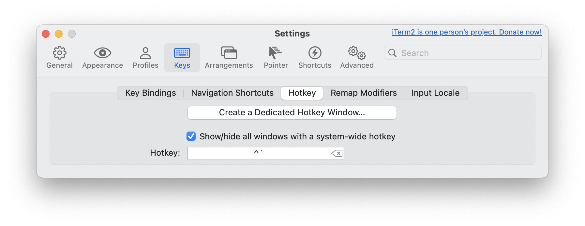
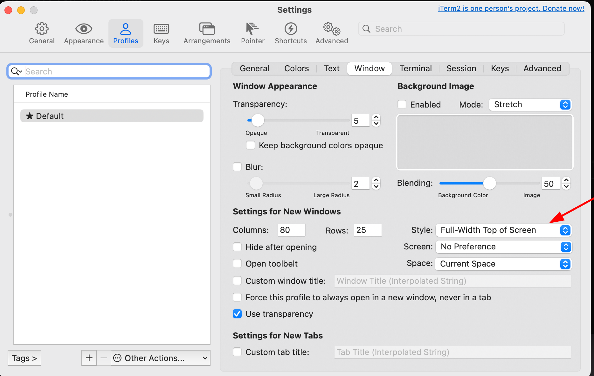
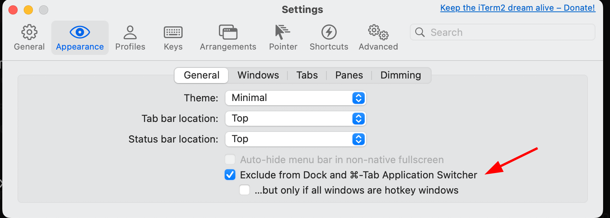
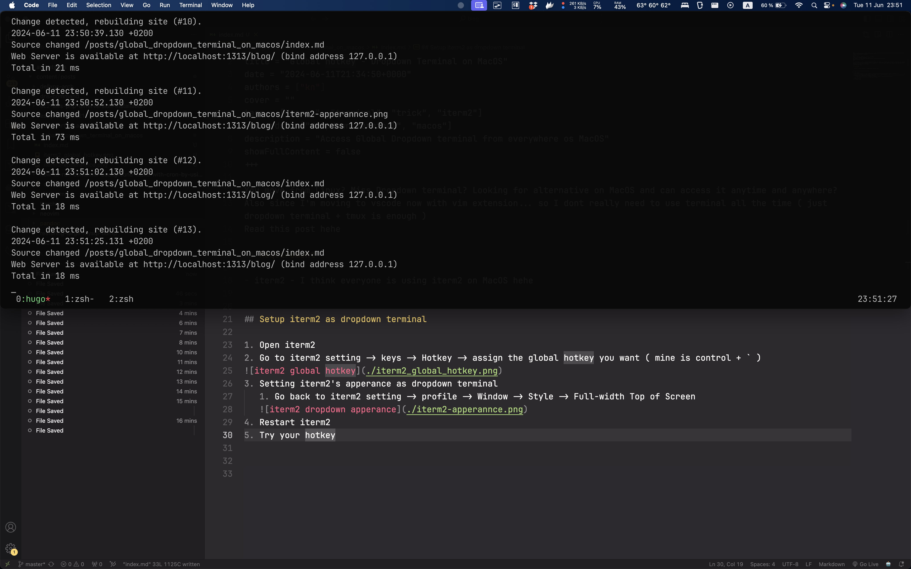

+++
title = "Global hotkey - Dropdown Terminal on MacOS"
date = "2024-06-11T21:34:50+0000"
authors = ["kn"]
cover = "posts/global_dropdown_terminal_on_macos/preview.png"
tags = ["macos", "terminal", "trick", "iterm2"]
keywords = ["dropdown terminal", "macos"]
description = "Access Global Dropdown terminal from everywhere os MacOS"
showFullContent = false
+++

You move from Linux? Miss Dropdown terminal? Looking for alternative on MacOS and can access it anytime and anywhere?
Also since I'm moving to vscode now with vim extension... so I dont really need to use terminal all the time ( just dropdown terminal + tmux is enough )
Read this post hehe

## Requirement

- iterm2 - I think everyone is using iterm2 on MacOS hehe

## Setup iterm2 as dropdown terminal

1. Open iterm2
2. Go to iterm2 setting -> keys -> Hotkey -> assign the global hotkey you want ( mine is control + ` )

3. Setting iterm2's apperance as dropdown terminal
   1. Go back to iterm2 setting -> profile -> Window -> Style -> Full-width Top of Screen
   
4. Exclude iterm2 from task switcher
   
5. Restart iterm2
6. Try your hotkey 

7. Add iterm2 to login iterm ( starting at boot )

Extra: you can use combo tmux + dropdow :)

Enjoy :v :v :v

