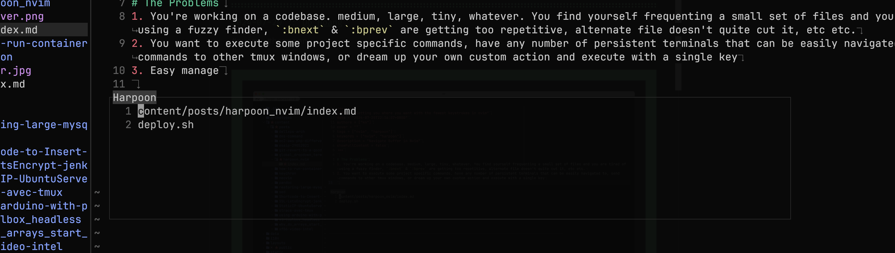

+++
title = "Getting you where you want with the fewest keystrokes in nvim"
date = "2024-07-20T22:16:07+0000"
authors = ["kn"]
cover = "posts/harpoon_nvim/cover.png"
tags = ["nvim", "harpoon"]
keywords = ["nvim", "harpoon"]
description = "Navigate Buffer in Nvim"
showFullContent = false
+++

# The Problems

1. You're working on a codebase. medium, large, tiny, whatever. You find yourself frequenting a small set of files and you are tired of using a fuzzy finder, `:bnext` & `:bprev` are getting too repetitive, alternate file doesn't quite cut it, etc etc.
2. You want to execute some project specific commands, have any number of persistent terminals that can be easily navigated to, send commands to other tmux windows, or dream up your own custom action and execute with a single key
3. Easy manage

# The Solutions - HARPOON

- Specify either by altering a ui or by adding via hot key files
- Unlimited lists and items within the lists

# Why?

It very easy with a hotkey (ie: `<leader>ha` to add file to the list, `<leader>hm` to togger list, and you can use vim keybind like `hjkl`, `dd` to delete that file)

# Installation

```lua
    {
        "ThePrimeagen/harpoon",
        branch = "harpoon2",
        dependencies = { "nvim-lua/plenary.nvim" },
        config = function()
            require("config.harpoon")
        end,
    },
```

Install with your favorite plugin manager ( here is lazy )
To config your keybind:

```lua
local harpoon = require('harpoon')
harpoon:setup({})

vim.keymap.set("n", "ha", function() harpoon:list():add() end)
vim.keymap.set("n", "hm", function() harpoon.ui:toggle_quick_menu(harpoon:list()) end)

-- Toggle previous & next buffers stored within Harpoon list
vim.keymap.set("n", "hp", function() harpoon:list():prev() end)
vim.keymap.set("n", "hn", function() harpoon:list():next() end)
```

You can also integrate with `Telescope`

# Demo



Enjoyyy
