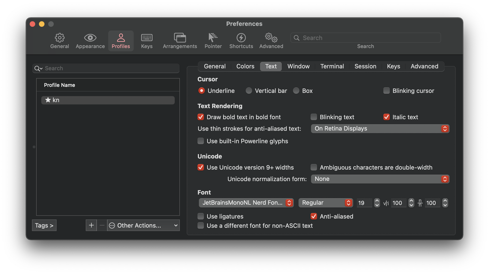
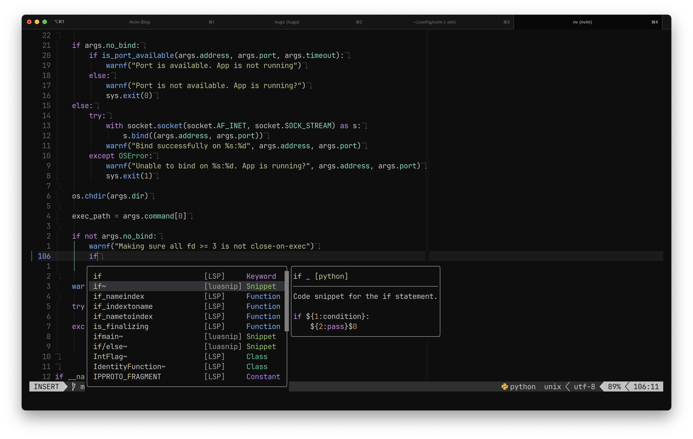
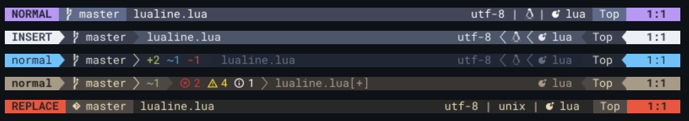
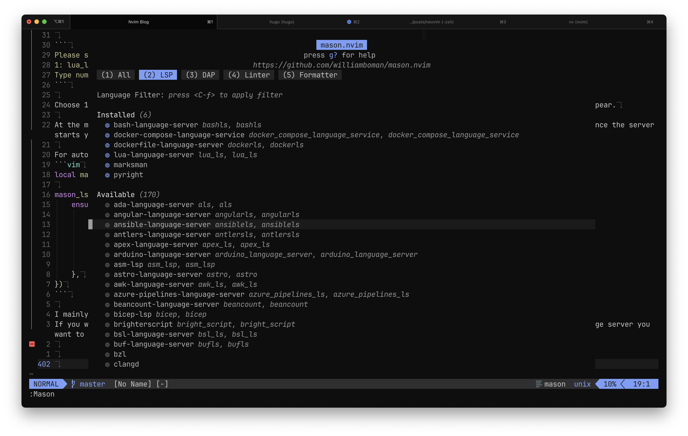
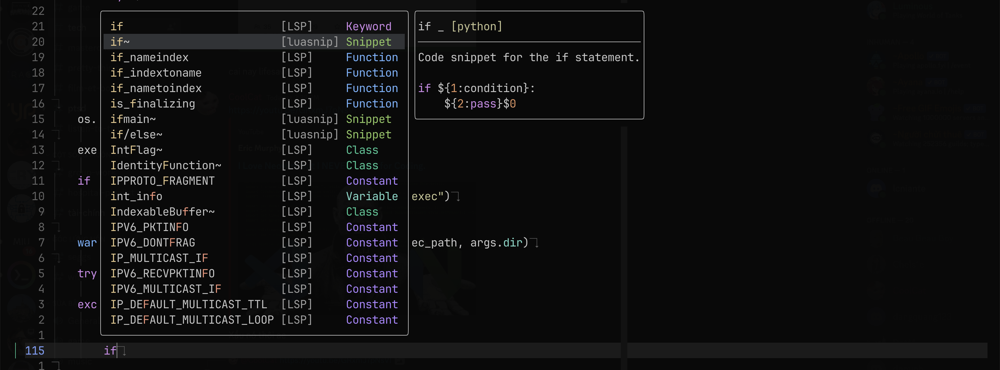
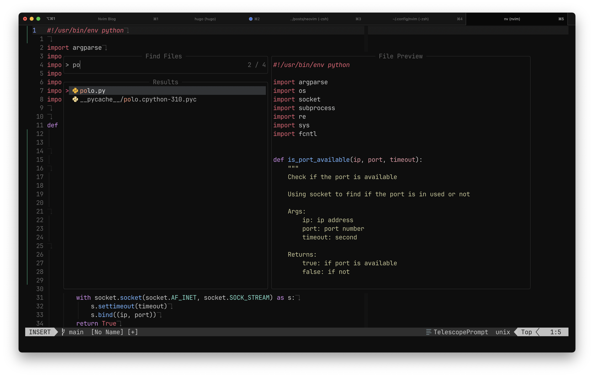
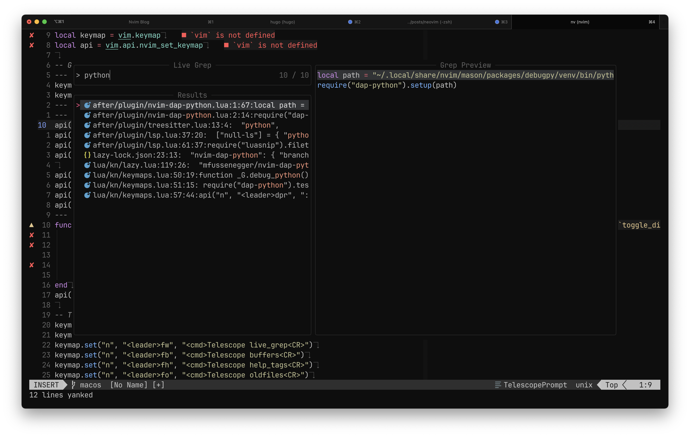
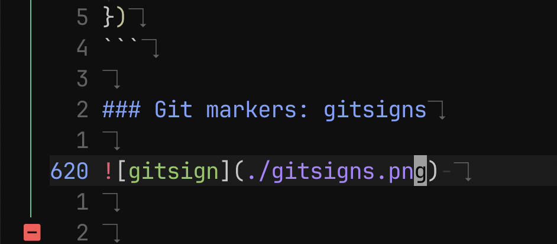
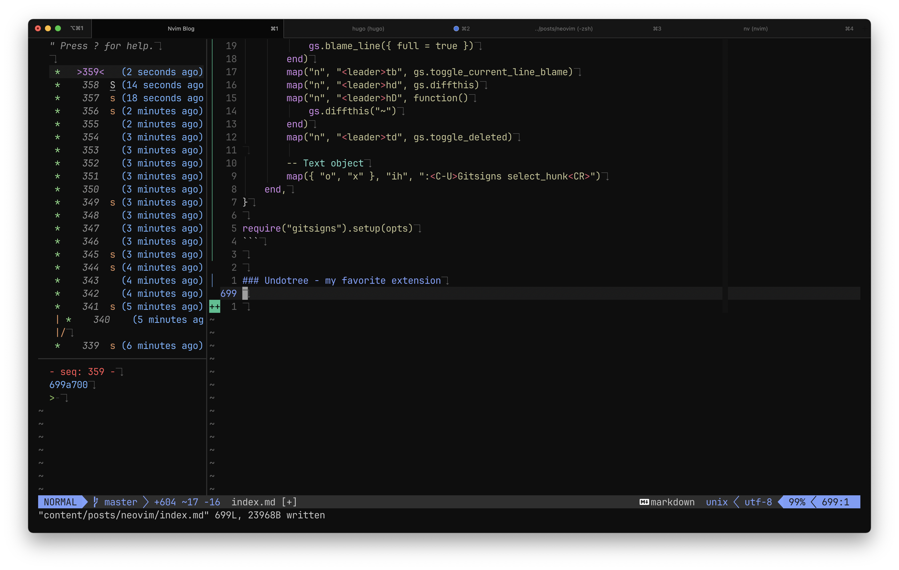
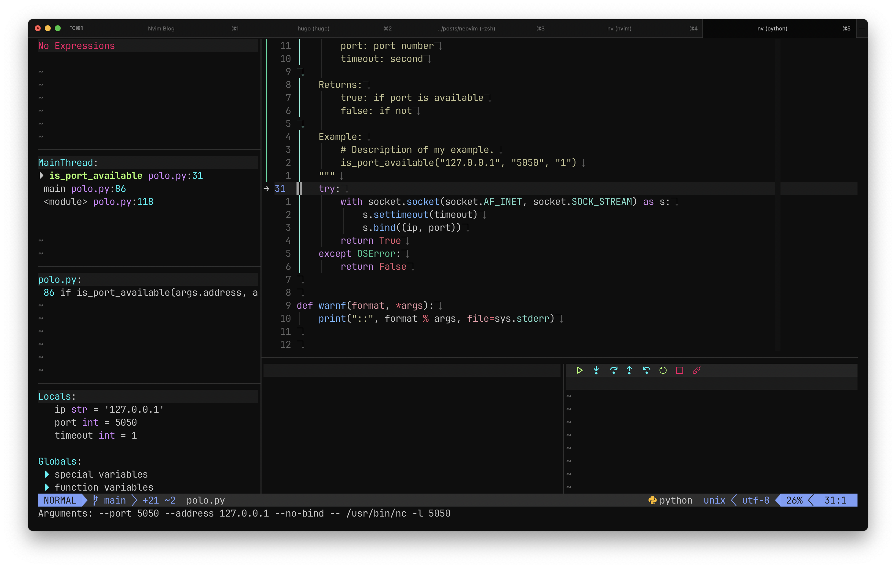

+++
title = "Neovim: From simple texteditor to IDE like"
date = "2023-07-15T23:28:43+0000"
authors = ["kn"]
cover = "posts/neovim/cover.png"
tags = ["neovim", "texteditor", "lsp", "mason", "lazy"]
keywords = ["neovim", "texteditor", "lsp", "mason"]
description = "My Neovim setup as DevOps day, Developer at night. IDE-like features based on LSP and Treesitter, fuzzy finder, and status line"
showFullContent = false
+++

Hi, it's Kn.

Neovim comes with cool new improvements like Lua remote plugin host, built-in LSP client (yes!), and Treesitter syntax engine
I found there are already a bunch of great plugins that leverage those features. I tried them, and already love them!
Also Since my current laptop is quite old ( a Macbook with core i5 gen 7th processor and 8gb ram ), Sublime Text or Vscode is too "hard" for him to handle. 

I'd like to introduce my latest setup with Neovim 0.9 and modern plugins. Here is a quick summary of my set up:
- [lazy.nvim](https://github.com/folke/lazy.nvim) - is a modern plugin manager for Neovim
- [LSP-zero](https://github.com/VonHeikemen/lsp-zero.nvim) - A starting point to setup some lsp related features in neovim.
- [mason](https://github.com/williamboman/mason.nvim) - Easily install and manage LSP servers, DAP servers, linters, and formatters
- [mason-lspconfig](https://github.com/williamboman/mason-lspconfig.nvim) - Extension to mason.nvim that makes it easier to use lspconfig with mason.nvim.
- [nvim-cmp](https://github.com/hrsh7th/nvim-cmp) - A completion plugin for neovim coded in Lua.
- [mason-null-Ls](https://github.com/jay-babu/mason-null-ls.nvim) - bridges mason.nvim with the null-ls plugin, making it easier to use both plugins together.
- [nvim-treesitter](https://github.com/nvim-treesitter/nvim-treesitter) - Treesitter configurations and abstraction layer for Neovim
- [telescope.nvim](https://github.com/nvim-telescope/telescope.nvim) - A highly extendable fuzzy finder over lists
- [lualine.nvim](https://github.com/nvim-lualine/lualine.nvim) - A blazing fast and easy to configure neovim statusline plugin written in pure lua
- [nvim-tree.lua](https://github.com/nvim-tree/nvim-tree.lua) - A file explorer tree for neovim written in lua
- [Indent-blank-line](https://github.com/lukas-reineke/indent-blankline.nvim) - Indent guides for Neovim
- [gitsigns](https://github.com/lewis6991/gitsigns.nvim) - Git integration for buffers
- [nvim-dap-ui, nvim-dap](https://github.com/mfussenegger/nvim-dap) - Debug Adapter Protocol client implementation for Neovim
- [autopairs](https://github.com/windwp/nvim-autopairs) - autopairs for neovim
- [undotree](https://github.com/mbbill/undotree) - The undo history visualizer for VIM

And here is my dotfiles repository:

https://github.com/huyhoang8398/dotfiles

## Prerequisites — iTerm2 and Patched Nerd Font

iTerm2 is a fast terminal emulator for macOS. Install one of Nerd Fonts for displaying fancy glyphs on your terminal. My current choice is JetBrainsMono Nerdfont. And use it on your terminal app. For example, on iTerm2:



My color theme is [Moonfly](https://github.com/bluz71/vim-moonfly-colors), which is a true color Moonfly theme.
The Moonfly theme for iTerm2 is in my dotfile repository [here](https://github.com/huyhoang8398/dotfiles/blob/macos/iterm.theme/moonfly.itermcolors) with a bit color customization.


| Type           | Category        | Value     | Color
|----------------|-----------------|-----------|------------------------------------------------------
| Background     | Background      | `#080808` | 
| Foreground     | Foreground      | `#bdbdbd` | 
| Bold           | Bold            | `#eeeeee` | 
| Cursor         | Cursor          | `#9e9e9e` | 
| Cursor Text    | Cursor Text     | `#080808` | 
| Selection      | Selection       | `#b2ceee` | 
| Selection Text | Selection Text  | `#080808` | 
| Color 1        | Black (normal)  | `#323437` | 
| Color 2        | Red (normal)    | `#ff5454` | 
| Color 3        | Green (normal)  | `#8cc85f` | 
| Color 4        | Yellow (normal) | `#e3c78a` | 
| Color 5        | Blue (normal)   | `#80a0ff` | 
| Color 6        | Purple (normal) | `#cf87e8` | 
| Color 7        | Cyan (normal)   | `#79dac8` | 
| Color 8        | White (normal)  | `#c6c6c6` | 
| Color 9        | Black (bright)  | `#949494` | 
| Color 10       | Red (bright)    | `#ff5189` | 
| Color 11       | Green (bright)  | `#36c692` | 
| Color 12       | Yellow (bright) | `#c2c292` | 
| Color 13       | Blue (bright)   | `#74b2ff` | 
| Color 14       | Purple (bright) | `#ae81ff` | 
| Color 15       | Cyan (bright)   | `#85dc85` | 
| Color 16       | White (bright)  | `#e4e4e4` | 

## Install Neovim

```bash
brew install neovim # MacOS
apt install neovim # Debian/Ubuntu
pacman -S neovim # Archlinux
```

## Directory structure

Neovim conforms `XDG Base Directory structure`. Here is my config file structure:

```
~/.config/nvim on  macos via 🌙 took 13s
❯ tree
.
├── after
│   └── plugin
│       ├── autopairs.lua
│       ├── colorscheme.lua
│       ├── gitsigns.lua
│       ├── indent_blankline.lua
│       ├── lsp.lua
│       ├── lualine.lua
│       ├── mason-lspconfig.lua
│       ├── mason-null-ls.lua
│       ├── mason.lua
│       ├── nvim-dap-python.lua
│       ├── nvim-dap-ui.lua
│       ├── nvim-tree.lua
│       ├── telescope.lua
│       └── treesitter.lua
├── ftdetect
│   └── groovy.lua
├── init.lua
├── lazy-lock.json
└── lua
    └── kn
        ├── init.lua
        ├── keymaps.lua
        ├── lazy.lua
        └── options.lua

6 directories, 21 files
```

## Install plugin manager: Lazy.nvim

Lazy.nvim comes with lots of features that I found useful sunch as:
- 📦 Manage all your Neovim plugins with a powerful UI
- 🚀 Fast startup times thanks to automatic caching and bytecode compilation of Lua modules
- 💾 Partial clones instead of shallow clones
- 🔌 Automatic lazy-loading of Lua modules and lazy-loading on events, commands, filetypes, and key mappings
- ⏳ Automatically install missing plugins before starting up Neovim, allowing you to start using it right away
- 💪 Async execution for improved performance
- 🛠️ No need to manually compile plugins
- 🧪 Correct sequencing of dependencies
- 📁 Configurable in multiple files
- 📚 Generates helptags of the headings in README.md files for plugins that don't have vimdocs
- 💻 Dev options and patterns for using local plugins
- 📊 Profiling tools to optimize performance
- 🔒 Lockfile lazy-lock.json to keep track of installed plugins
- 🔎 Automatically check for updates
- 📋 Commit, branch, tag, version, and full Semver support
- 📈 Statusline component to see the number of pending updates
- 🎨 Automatically lazy-loads colorschemes

### Setup 

Firstly, create a `lazy.lua` file in `~/.config/nvim/lua/kn/` with this content
You then can add the following Lua code to your `lazy.lua` to bootstrap `lazy.nvim`:

```vim
-- Lazy.nvim --
local lazypath = vim.fn.stdpath("data") .. "/lazy/lazy.nvim"
if not vim.loop.fs_stat(lazypath) then
	vim.fn.system({
		"git",
		"clone",
		"--filter=blob:none",
		"https://github.com/folke/lazy.nvim.git",
		"--branch=stable", -- latest stable release
		lazypath,
	})
end
vim.opt.rtp:prepend(lazypath)
```
Next step is to add lazy.nvim below the code added in the prior step in `init.lua`:

```vim
require("lazy").setup(plugins, opts)
```

`plugins`: this is all the plugin that you want to install and should be a table or a string
- `table`: a list with your Plugin Spec
- `string`: a Lua module name that contains your Plugin Spec.

`opts`: this should be lazy nvim options itself and should be a table.

**Example Options**

```vim
local opts = {
	defaults = { lazy = false },
	install = {
		missing = true,
		colorscheme = { "moonfly", "habamax" },
	},

	ui = {
		icons = {
			ft = "",
			lazy = "󰂠 ",
			loaded = "",
			not_loaded = "",
		},
	},

	performance = {
		cache = {
			enabled = true,
		},
		reset_packpath = true, -- reset the package path to improve startup time
	},
}
```

**Example Plugin Install** 
```vim
local plugins = {
	{
		"bluz71/vim-moonfly-colors",
		name = "moonfly",
		lazy = false,
		priority = 1000,
	},
    -- lualine (status line) --
	{
		"nvim-lualine/lualine.nvim",
		dependencies = { "nvim-tree/nvim-web-devicons" },
	},
}
```

In this Blog, I will cover only some essenstial plugins, the rest you could see in my `dotfiles` link above

### Colorscheme

Im using [Moonfly](https://github.com/bluz71/vim-moonfly-colors) - a dark charcoal theme with some options:

```vim
local g = vim.g

g.moonflyWinSeparator = 2
g.moonflyVirtualTextColor = true
g.moonflyUnderlineMatchParen = true
g.moonflyCursorColor = true
g.moonflyTransparent = true
g.moonflyNormalFloat = true

-- Overwrite folder color in nvimtree
vim.api.nvim_create_autocmd("ColorScheme", {
	pattern = "moonfly",
	callback = function()
		vim.api.nvim_set_hl(0, "NvimTreeFolderIcon", { link = "MoonflyBlue" })
	end,
	group = vim.api.nvim_create_augroup("CustomHighlight", {}),
})

vim.cmd([[colorscheme moonfly]])
```

It supports treesitter and other plugins very well and Also the maintainer is really friendly (We talk alots in Discord)

 

### Status line: Lualine

 

[nvim-lualine/lualine](https://github.com/nvim-lualine/lualine.nvim) provides a flexible way to configure statusline

```vim
local lualine_sections = {
	lualine_a = { "mode" },
	lualine_b = { "branch", "b:gitsigns_status" },
	lualine_c = {
		"filename",
		{
			"diagnostics",
			sources = { "nvim_diagnostic" },
			--symbols = { error = "E:", warn = "W:", info = "I:", hint = "H:" },
		},
		"g:metals_status",
	},
	lualine_x = { "filetype" },
	lualine_y = { { "fileformat", icons_enabled = false }, "encoding" },
	lualine_z = { "progress", "location" },
}

local opts = {
	options = {
		icons_enabled = true,
		globalstatus = true,
		theme = "moonfly",
		--component_separators = "|",
		--section_separators = "",
		disabled_filetypes = {},
	},
	sections = lualine_sections,
	inactive_sections = vim.deepcopy(lualine_sections),
	tabline = {},
	extensions = { "nvim-tree" },
}
```

### LSP Zero - LSP Lifesaver

The purpose of this plugin is to bundle all the "boilerplate code" necessary to have `nvim-cmp` (a popular autocompletion plugin) and `nvim-lspconfig` working together. And if you opt in, it can use `mason.nvim` to let you install language servers from inside neovim.

It used to be very difficult to setup language server, autocompletion, etc with CoC or similar, but now Neovim has a built-in LSP support. You can easily configure it by using `neovim/nvim-lspconfig` and `Mason`.

For me I found that LSP zero is lifesaver but you could also consider [you might not need lsp-zero](https://github.com/VonHeikemen/lsp-zero.nvim/blob/v2.x/doc/md/lsp.md#you-might-not-need-lsp-zero).

#### LSP setup

```vim
	{
		"VonHeikemen/lsp-zero.nvim",
		branch = "v2.x",
		dependencies = {
			-- LSP Support
			{ "neovim/nvim-lspconfig" },
			{ "williamboman/mason.nvim" },
			{ "williamboman/mason-lspconfig.nvim" },
			{
				"jay-babu/mason-null-ls.nvim",
				event = { "BufReadPre", "BufNewFile" },
				dependencies = {
					"williamboman/mason.nvim",
					"jose-elias-alvarez/null-ls.nvim",
				},
			},

			-- Autocompletion
			{ "hrsh7th/nvim-cmp" },
			{ "hrsh7th/cmp-nvim-lua" },
			{ "hrsh7th/cmp-buffer" },
			{ "hrsh7th/cmp-path" },
			{ "hrsh7th/cmp-nvim-lsp" },
			{ "saadparwaiz1/cmp_luasnip" },
			{ "hrsh7th/cmp-nvim-lsp-signature-help" },
			{
				"L3MON4D3/LuaSnip",
				build = "make install_jsregexp",
				dependencies = {
					"rafamadriz/friendly-snippets",
				},
			},
		},
```

My above template will cover all requirement for LSP, Autocompletion and Snippet

Language servers are configured and initialized using `nvim-lspconfig`.

**Example Config** 

```vim
local lsp = require("lsp-zero").preset({ float_border = "rounded", configure_diagnostics = true })
lsp.on_attach(function(client, bufnr)
	lsp.default_keymaps({ buffer = bufnr })
	local opts = { buffer = bufnr }
	vim.keymap.set("n", "gd", "<cmd>Telescope lsp_definitions<cr>", opts)
	vim.keymap.set("n", "gr", "<cmd>Telescope lsp_references<cr>", opts)
	vim.keymap.set("n", "gl", "<cmd>lua vim.diagnostic.open_float()<cr>", opts)
	vim.keymap.set("n", "[d", "<cmd>lua vim.diagnostic.goto_prev()<cr>", opts)
	vim.keymap.set("n", "]d", "<cmd>lua vim.diagnostic.goto_next()<cr>", opts)
	vim.keymap.set("n", "<leader>wa", vim.lsp.buf.add_workspace_folder, opts)
	vim.keymap.set("n", "<leader>wr", vim.lsp.buf.remove_workspace_folder, opts)
	vim.keymap.set("n", "<leader>wl", function()
		print(vim.inspect(vim.lsp.buf.list_workspace_folders()))
	end, opts)
	vim.keymap.set("n", "<leader>ca", function()
		vim.lsp.buf.code_action({ apply = true })
	end, opts)
	vim.keymap.set("n", "<leader>D", vim.lsp.buf.type_definition, opts)
	vim.keymap.set("n", "<leader>rn", vim.lsp.buf.rename, opts)
end)
```

### Install a language server
Let's try to use the language server for lua.

Open your `init.lua` and execute the command `:LspInstall`. Now `mason.nvim` will suggest a language server. Neovim should show a message like this.

```
Please select which server you want to install for filetype "lua":
1: lua_ls
Type number and <Enter> or click with the mouse (q or empty cancels):
```

Choose 1 for `lua_ls`, then press enter. A floating window will show up. When the server is done installing, a message should appear.

At the moment the language server can't start automatically, restart Neovim so the language server can be configured properly. Once the server starts you'll notice warning signs in the global variable vim, that means everything is well and good.

For automatically installing any language server, you could create a file in `after/plugin/mason-lspconfig.lua
```vim
local mason_lspconfig = require("mason-lspconfig")

mason_lspconfig.setup({
	ensure_installed = {
		"pyright",
		"lua_ls",
		"bashls",
		"docker_compose_language_service",
		"dockerls",
		"marksman",
	},
})
```

I mainly use Bash, Python and Go so it will will automtically install these languague server
If you want to manully install this, try to run `:Mason`, a popup screen will show like this and you could chose whatever language server you want to install



### Auto-completion: cmp



To get LSP-aware auto-completion feature with fancy pictograms, I use the following plugins:

- L3MON4D3/LuaSnip - Snippet engine
- hrsh7th/cmp-nvim-lsp - nvim-cmp source for neovim's built-in LSP
- hrsh7th/cmp-buffer - nvim-cmp source for buffer words
- hrsh7th/nvim-cmp - A completion engine plugin for neovim
- hrsh7th/cmp-path - Path completion
- hrsh7th/cmp-nvim-lsp-signature-help - Signature help

Configure it like so:

```vim
-- Make sure you setup `cmp` after lsp-zero
local cmp = require("cmp")
local cmp_action = require("lsp-zero").cmp_action()

vim.tbl_map(function(type)
	require("luasnip.loaders.from_" .. type).lazy_load()
end, { "vscode", "snipmate", "lua" })
require("luasnip").filetype_extend("python", { "pydoc" })
require("luasnip").filetype_extend("sh", { "shelldoc" })

cmp.setup({
	snippet = {
		expand = function(args)
			require("luasnip").lsp_expand(args.body)
		end,
	},
	window = {
		completion = cmp.config.window.bordered(),
		documentation = cmp.config.window.bordered(),
	},
	sources = {
		{ name = "nvim_lsp" },
		{ name = "luasnip" },
		{ name = "buffer" },
		{ name = "nvim_lua" },
		{ name = "path" },
		{ name = "nvim_lsp_signature_help" },
	},
	mapping = {
		["<CR>"] = cmp.mapping.confirm({ select = false }),
		["<Tab>"] = cmp_action.luasnip_supertab(),
		["<S-Tab>"] = cmp_action.luasnip_shift_supertab(),
	},
})
```

### Syntax highlightings: Treesitter


Treesitter is a popular language parser for syntax highlightings. First, install it:

```bash
brew install tree-sitter
```

Install `nvim-treesitter/nvim-treesitter` with Lazy and configure it like so:

```vim
local opts = {
	highlight = { enable = true },
	indent = { enable = true },
	autotag = { enable = true },
	ensure_installed = {
		"dockerfile",
		"go",
		"bash",
		"json",
		"lua",
		"markdown",
		"markdown_inline",
		"python",
		"yaml",
	},
}

require("nvim-treesitter.configs").setup(opts)
```

### Fuzz finder: Telescope



`telescope.nvim` provides an interactive fuzzy finder over lists, built on top of the latest Neovim features. I also use telescope-file-browser.nvim as a filer.

It’s so useful because you can search files while viewing the content of the files without actually opening them. It supports various sources like Vim, [files](https://github.com/nvim-telescope/telescope.nvim#file-pickers), [Git](https://github.com/nvim-telescope/telescope.nvim#git-pickers), [LSP](https://github.com/nvim-telescope/telescope.nvim#lsp-pickers), and [Treesitter](https://github.com/nvim-telescope/telescope.nvim#treesitter-picker). Check out the [showcase](https://github.com/nvim-telescope/telescope.nvim/wiki/Showcase) of Telescope.

Install [kyazdani42/nvim-web-devicons](https://github.com/nvim-tree/nvim-web-devicons) to get file icons on Telescope, statusline, and other supported plugins.

The configuration would look like so:

```vim
local opts = {
	defaults = {
		vimgrep_arguments = {
			"rg",
			"-L",
			"--color=never",
			"--no-heading",
			"--with-filename",
			"--line-number",
			"--column",
			"--smart-case",
		},
		entry_prefix = "  ",
		initial_mode = "insert",
		selection_strategy = "reset",
		sorting_strategy = "ascending",
		layout_strategy = "horizontal",
		layout_config = {
			horizontal = {
				prompt_position = "top",
				preview_width = 0.55,
				results_width = 0.8,
			},
			vertical = {
				mirror = false,
			},
			width = 0.87,
			height = 0.80,
			preview_cutoff = 120,
		},
		file_ignore_patterns = { "node_modules" },
		file_previewer = require("telescope.previewers").vim_buffer_cat.new,
		grep_previewer = require("telescope.previewers").vim_buffer_vimgrep.new,
		qflist_previewer = require("telescope.previewers").vim_buffer_qflist.new,
		mappings = {
			i = {
				["<esc>"] = require("telescope.actions").close,
			},
		},
	},
	extensions = {
		fzf = {
			fuzzy = true, -- false will only do exact matching
			override_generic_sorter = true, -- override the generic sorter
			override_file_sorter = true, -- override the file sorter
			case_mode = "smart_case", -- or "ignore_case" or "respect_case"
			-- the default case_mode is "smart_case"
		},
	},
}

require("telescope").setup(opts)
```

**keymaps** 
```vim
-- Telescope --
local keymap = vim.keymap
keymap.set("n", "<leader>\\", "<cmd>Telescope find_files<CR>")
keymap.set("n", "<leader>fa", "<cmd>Telescope find_files follow=true no_ignore=true hidden=true<CR>")
keymap.set("n", "<leader>fw", "<cmd>Telescope live_grep<CR>")
keymap.set("n", "<leader>fb", "<cmd>Telescope buffers<CR>")
keymap.set("n", "<leader>fh", "<cmd>Telescope help_tags<CR>")
keymap.set("n", "<leader>fo", "<cmd>Telescope oldfiles<CR>")
keymap.set("n", "<leader>fz", "<cmd>Telescope current_buffer_fuzzy_find<CR>")
keymap.set("n", "<leader>cm", "<cmd>Telescope git_commits<CR>")
keymap.set("n", "<leader>gt", "<cmd>Telescope git_status<CR>")
keymap.set("n", "<leader>ma", "<cmd>Telescope marks<CR>")
keymap.set("n", "<leader>dg", "<cmd>Telescope diagnostics<CR>")
```




### Code formatter: null-ls


I use null-ls for code formatting and extra diagnostics
The config example as following:

```vim
require("mason").setup()
local null_ls = require("null-ls")
null_ls.setup({
	sources = {
		-- Replace these with the tools you want to install
		-- make sure the source name is supported by null-ls
		-- https://github.com/jose-elias-alvarez/null-ls.nvim/blob/main/doc/BUILTINS.md
		null_ls.builtins.formatting.black,
		null_ls.builtins.formatting.stylua,
		null_ls.builtins.formatting.shfmt,
		null_ls.builtins.diagnostics.hadolint,
		null_ls.builtins.diagnostics.selene,
		null_ls.builtins.diagnostics.shellcheck,
		null_ls.builtins.diagnostics.ruff,
		null_ls.builtins.diagnostics.mypy,
	},
})
-- See mason-null-ls.nvim's documentation for more details:
-- https://github.com/jay-babu/mason-null-ls.nvim#setup
require("mason-null-ls").setup({
	ensure_installed = {
		"shellcheck",
		"selene",
		"hadolint",
		"black",
		"shfmt",
		"stylua",
		"ruff",
		"mypy",
		"debugpy",
		"bash-debug-adapter",
	},
	automatic_installation = true,
})
```

### Git markers: gitsigns

 

`lewis6991/gitsigns.nvim` provides git decorations for current buffers. It helps you know which lines are currently changed. It works out of the box.

I made some configuration and hotkey to suite my usage

```vim
local opts = {
	signs = {
		add = { text = "│" },
		change = { text = "│" },
		delete = { text = "󰍵" },
		topdelete = { text = "‾" },
		changedelete = { text = "~" },
		untracked = { text = "│" },
	},
	on_attach = function(bufnr)
		local gs = package.loaded.gitsigns

		local function map(mode, l, r, opts)
			opts = opts or {}
			opts.buffer = bufnr
			vim.keymap.set(mode, l, r, opts)
		end

		-- Navigation
		map("n", "]c", function()
			if vim.wo.diff then
				return "]c"
			end
			vim.schedule(function()
				gs.next_hunk()
			end)
			return "<Ignore>"
		end, { expr = true })

		map("n", "[c", function()
			if vim.wo.diff then
				return "[c"
			end
			vim.schedule(function()
				gs.prev_hunk()
			end)
			return "<Ignore>"
		end, { expr = true })

		-- Actions
		map("n", "<leader>hs", gs.stage_hunk)
		map("n", "<leader>hr", gs.reset_hunk)
		map("v", "<leader>hs", function()
			gs.stage_hunk({ vim.fn.line("."), vim.fn.line("v") })
		end)
		map("v", "<leader>hr", function()
			gs.reset_hunk({ vim.fn.line("."), vim.fn.line("v") })
		end)
		map("n", "<leader>hS", gs.stage_buffer)
		map("n", "<leader>hu", gs.undo_stage_hunk)
		map("n", "<leader>hR", gs.reset_buffer)
		map("n", "<leader>hp", gs.preview_hunk)
		map("n", "<leader>hb", function()
			gs.blame_line({ full = true })
		end)
		map("n", "<leader>tb", gs.toggle_current_line_blame)
		map("n", "<leader>hd", gs.diffthis)
		map("n", "<leader>hD", function()
			gs.diffthis("~")
		end)
		map("n", "<leader>td", gs.toggle_deleted)

		-- Text object
		map({ "o", "x" }, "ih", ":<C-U>Gitsigns select_hunk<CR>")
	end,
}

require("gitsigns").setup(opts)
```


### Undotree - my favorite extension

 

The undo history visualizer for VIM
Install it with 
```vim
{ "mbbill/undotree" },
```

should work out of box

### Debugging

 

Im currently using `mfussenegger/nvim-dap` for debugging, thanks to Microsoft Debug Adapter Protocol

```vim
local dap = require("dap")
local dapui = require("dapui")
-- bash debug
dap.adapters.bashdb = {
	type = "executable",
	command = vim.fn.stdpath("data") .. "/mason/packages/bash-debug-adapter/bash-debug-adapter",
	name = "bashdb",
}

dap.configurations.sh = {
	{
		type = "bashdb",
		request = "launch",
		name = "Launch file",
		showDebugOutput = true,
		pathBashdb = vim.fn.stdpath("data") .. "/mason/packages/bash-debug-adapter/extension/bashdb_dir/bashdb",
		pathBashdbLib = vim.fn.stdpath("data") .. "/mason/packages/bash-debug-adapter/extension/bashdb_dir",
		trace = true,
		file = "${file}",
		program = "${file}",
		cwd = "${workspaceFolder}",
		pathCat = "cat",
		pathBash = "/bin/bash",
		pathMkfifo = "mkfifo",
		pathPkill = "pkill",
		args = {},
		env = {},
		terminalKind = "integrated",
	},
}

dapui.setup()

-- use nvim-dap events to open and close the windows automatically
dap.listeners.after.event_initialized["dapui_config"] = function()
	dapui.open()
end
dap.listeners.before.event_terminated["dapui_config"] = function()
	dapui.close()
end
dap.listeners.before.event_exited["dapui_config"] = function()
	dapui.close()
end
```

with some keybind:

```vim
-- nvim-dap --
function _G.debug_python()
	require("dap-python").test_method()
end

keymap.set("n", "<leader>b", ":lua require'dap'.toggle_breakpoint()<CR>")
keymap.set("n", "<leader>B", ":lua require'dap'.set_breakpoint(vim.fn.input('Breakpoint condition: '))<CR>")
keymap.set("n", "<leader>db", ":lua require'dapui'.toggle()<CR>")
api("n", "<leader>dpr", ":call v:lua.debug_python()<CR>", { noremap = true, silent = true })
```
                                            ...
That’s pretty much it! I hope it’s helpful for improving your Neovim environment.


