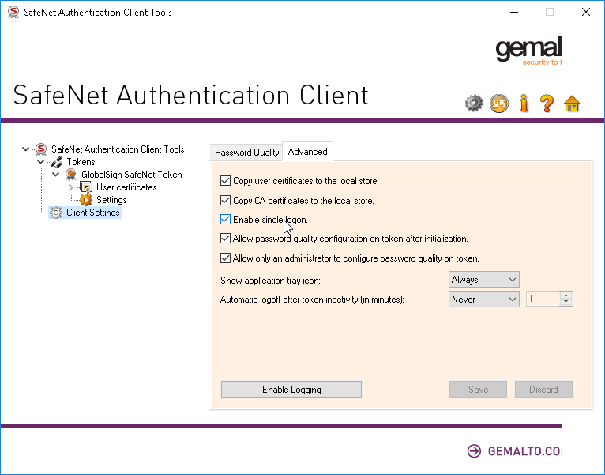

At work we’ve recently needed to sign our software, so that our customers will not get ugly and scary warnings when installing it via the provided MSI packages. And after working in France, I found that they mainly using USB Token ( from Thales ) for code signing.

Apparently, since February 2017, [Microsoft requires the private key to be stored securely](https://pkic.org/2016/12/08/leading-certificate-authorities-and-microsoft-introduce-new-standards-to-protect-consumers-online/) on a USB token, from which it is not exportable. This requires the user to use the software provided by their chosen CA (GlobalSign in our case) to verify ownership during the actual signing process.

## Proxmox passthrough USB Token

**Simple Way: pass the USB device ID to the guest**

Assigning an Aladdin memory stick connected to the host to VM 804.

Figure out in the host the Device Type by

```bash
lsusb | grep Aladdin
```

The result is

```bash
Bus 002 Device 013: ID 058f:6387 Alcor Micro Corp. Flash Drive
```

Assign it to the VM by

```bash
qm set 804 -usb0 host=058f:6387
```

Shutdown the VM (if running) and start it again.

## signtool Basics

Once you have your token (and its password), you can run signtool as normal to sign a file:

`signtool.exe sign /a /v /t http://timestamp.verisign.com/scripts/timestamp.dll MY_MSI_FILE.msi`

- `/a` selects the best certificate automatically
- `/v` makes the process verbose
- `/t` defines the timestamping URL, which is also required since at least 2017
Now the only question is: how does this integrate in your Gitlab CI workflow?

## The Build Server

We’re using a virtual machine in our office as a Gitlab CI runner, which has exclusive hardware access to the USB port and the USB token. What we’ve learned is that when using RDP to connect to the server, Windows would disconnect the token, rendering it useless. Sometimes this required us to reboot the VM, sometimes it would reconnect automatically once the RDP connection was closed.

Therefore, when working with the virtual machine, **use VNC**.

## Gitlab CI Runner
Originally, we’ve had the runner setup according to [documentation](https://docs.gitlab.com/runner/install/windows/), with it running as Windows service. This had a couple of issues though:

Running as the SYSTEM user, the runner process (and the signtool it would spawn) could not see the certificate, which we’ve imported into the local user’s cert store. If you’re getting

```
SignTool Error: No certificates were found that met all the given criteria.
```
make sure the runner is using the correct user account.

After changing the service’s user account, signtool would find the certificate, but still fail to actually sign the binary:

```
Error information: "Error: SignerSign() failed." (-2147023673/0x800704c7)
SignTool Error: An unexpected internal error has occurred.
```

As it turns out, [Windows services are not allowed to spawn GUI elements](https://stackoverflow.com/questions/24672843/node-js-windows-service-cannot-spawn-gui-app-from-service/24710666#24710666). We found no way to both run the service under a local user account and disable the session isolation, so in the end we opted to simply run the runner process manually (with a primitive shortcut to gitlab-runner.exe run). From there on, the runner could spawn the signtool, which would in turn find the correct certificate and pop up the SafeNet software, asking for the token password.

This password prompt is the only part of our build pipeline that we cannot automate. There are probably ways around this, but it seems that this is against the spirit of USB tokens and we’re not Windows developery by heart. We build installers rarely, so it works fine to just have a VNC window open and supply the password when our CI pipeline is running.


## Single Token Logon

Apparently, the SafeNet client has an option to require only a single logon per session. It’s hidden in the advanced section of the Client Settings and is disabled by default:



After enabling the option and saving, you have to enter your token password only on the next signtool invocation and then only after rebooting the machine. Hooray!

**So whenever you reboot the machine, the first token need to be filled manually -> then after that it will not ask again until you reboot the machine**

This could mean that running the Gitlab CI runner as a (non-SYSTEM) Windows service is an option now, as long as you manually logon to the token before running your first build job, but we’ve opted to stay with the desktop shortcut variant.


